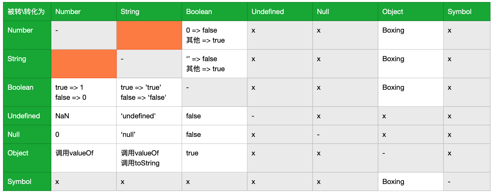

# 周总结
首先这周的课程真的很多很多，超出了我业余时间的承受能力，所以本周作业与练习并没有非常完整的完成。

但是我完成了带括号的四则运算的产生式与字符使用UTF8的表示这两个我之前不能完成的任务，也算挑战了自己。

学习了课程，我对JavaScript的认知从另一个更好的维度有了更深刻的认知。

列出所有待办
- [ ] 4：理解命令式与声明式的区别，对语言进行分类
- [ ] 7：深刻理解数字在计算机中如何表示，模仿老师的写一个demo
- [ ] 10：狗咬人的深刻理解，并完成作业
- [ ] 11：找出 JavaScript 标准里面所有具有特殊行为的对象
- [ ] 二2：完成 StringToNumber 和 NumberToString 两个函数
- [ ] 二7：尝试找出 JavaScript 引擎里面 Realm 所有的对象，使用一个 JS 数据可视化的框架去做一个可视化
- [ ] 完成课前预习week00里的快速排序
- [ ] 再看一遍重学JavaScript二
- [ ] 按自己的理解补全脑图
- [ ] 直播课：HTML有多少标签

----
# 学习笔记
### 1.泛用语言分类方法
语言按语法分类
* 非形式语言
    * 中文、英文
* 形式语言
    * 乔姆斯基谱系
        * 0型：无限制文法
        * 1型：上下文相关文法
        * 2型：上下文无关文法
        * 3型：正则文法

乔姆斯基谱系里面的文法有属于包含关系，例如3型隶属于0、1、2型

### 2.什么是产生式

#### 练习
```
<ParenthesisExpression>::=<AddtiveExpression>|
"("<AddtiveExpression>")"|
<ParenthesisExpression>"+"<ParenthesisExpression>|
<ParenthesisExpression>"-"<ParenthesisExpression>|
<ParenthesisExpression>"*"<ParenthesisExpression>|
<ParenthesisExpression>"/"<ParenthesisExpression>
```
不知道(13+14)这种两端带括号的是不是正常的四则运算，如果是，那么再加上下面一种情况：
`"("<ParenthesisExpression>")"`

解题思路：
1. 分析给出的已有产生式，知道他能代表所有的简单四则运算（不带括号）
2. 明确目标：产生式可以代表所有的带括号的四则运算表达式
3. 写出几个实例，找出规律（难点是理解递归思想），写出产生式
4. 带入验证，不符合再进行第三步，知道找出符合的产生式

### 3.深入理解产生式
无限制文法里面左边可以产生多个非终结符
上下文相关文法，左右两边可以写多个，但只能有一个可变
上下文无关文法左边只能有一个非终结符
正则文法递归不能出现在尾部

### 4.现代语言的分类
语言里面大部分语句都是上下文无关文法
JS中/既是除号，也是正则表达式的开头
大部分主流语言都不是完全的形式语言

形式语言用途
* 数据描述语言
    * JSON
    * XAML
    * YML
    * XAML
    * XML
    * SQL
    * CSS
* 编程语言
    * C
    * C++
    * Java
    * C#
    * Python
    * PHP
形式语言表达方式
* 声明式语言：结果
    * 函数式语言
    * 大部分的数据描述语言
* 命令型语言：步骤
    * 和编程语言基本重合


#### 练习
- [ ] ⌛️作业没交

作业因为没有能区分出来声明式和命令式的根本区别，感觉像`Array.prototype.map`这种函数就是命令式的但它为什么属于声明式语言？

数据描述语言：
JSON、HTML、XML、CSS、SQL、Markdown、YAML
编程语言：
C、JAVA、Python、C++、C#、VB、JavaScript、PHP、SQL、Swift、Go、Perl、Ruby、Rust、Objective-C、Lua、TypeScript

### 4.编程语言的性质
图灵完备性
* 命令式--图灵机
    * goto
    * if与while
* 声明式--lambda
    * 递归
动态与静态
* 动态
    * 用户设备/在线服务器上
    * 产品实际运行时
    * Runtime
* 静态
    * 程序员设备上
    * 产品开发时
    * Compiletime
类型系统
* 动态类型系统与静态类型系统
*  强类型与弱类型（类型转换）
    * 强类型语言不会自动转换
* 复合类型
    * 结构体
    * 函数签名
* 子类型
* 泛型
    * 逆变/协变
6.一般命令式语言的设计方式
* 原子级
    * 关键字：if
    * 直接量：123
    * 变量名：window
* 表达式
* 语句
* 结构
* 组织
    * package
    * module
    * library

### 7.JS类型-Number
* Literal
* Variable
* Keywords
* Whitespace
* Line Terminator

类型
* Number
* String
* Boolean
* Object
* Null
* Undefined
* Symbol

双精度浮点类型（Double Float）
* 1符号位
* 11指数位（范围）
    * 正值：1+10个0（2^0=1）～1+10个1（2^10-1=1023）
    * 负值：0+10个0（-2^0=-1）～0+10个1（-2^10+1=-1023）
* 52精度位（精度）
    * 隐藏位（或叫省略位，省略了1）
 
【纠正】11分40秒左右：10个1只能有2^10-1种可能性，也就是1023，而不是2048。
【纠正】12:00：最小的数应该是一个0与10个1

* 十进制
    * `0`
    * `0.`
    * `.2`
    * `1e3`
* 二进制
    * 0b111
* 八进制
    * 0o17
* 十六进制
    * 0xFF

[数字的二进制展示工具](http://jsfiddle.net/pLh8qeor/19)
- [ ] ⌛️完全了解数值在计算机中如何用二进制展示

### 8.JS类型-String
A形状叫字形，字符结合字体把字的形状表达出来。
字符（Character）对应一个码点（Code Point），一个字符可能有不同的码点，规定码点的东西叫字符集，例如Unicode字符集，ASCII字符集。
存储码点的方式叫做编码方式（Encoding），例如UTF8。

#### 练习
写一段 JS 的函数，把一个 string 它代表的字节给它转换出来，用 UTF8 对 string 进行遍码。
在[./practices/string2utf8.html](./practices/string2utf8.html)

### 9.JS类型-其他类型

### 10.JS对象-对象基础

在设计对象的行为和状态时，我们总是遵循“行为改变状态”的原则。
- [ ] ⌛️作业，狗咬人

1.JS表达式-运算符和表达式


2.JS表达式-类型转换
什么情况下会发生隐式类型转换？
* 位元算：先转Number，调用valueOf，再转整数
* `==`
* 对基础类型使用.或[]取属性，会自动进行装箱转换
* 



Unboxing
* 有Symbol.toPrimitive，一定调用该属性
* 需要数字时，优先调用valueOf，其次调用toString
* 需要字符串时，优先调用toString，否则返回undefined
* 即使是与字符串相加，也判断为需要数字

| 类型 | 对象 | 值 |
| --- | --- | --- |
| Number | new Number(3) | 3 |
| String | new Sting('3') | '3' |
| Boolean | new Boolean(true) | true |
| Symbol | new Object(Symbol('a')) | Symbol('a') |

- [ ] ⌛️完成 StringToNumber 和 NumberToString 两个函数
